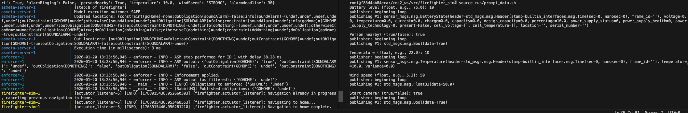

# A Process to Enforce Ethical Requirements of Autonomous Systems at Runtime

This is the replication package for the paper _A Process to Enforce Ethical Requirements of Autonomous Systems at Runtime_ accepted at the _21st International Conference on Software Engineering for Adaptive and Self-Managing Systems_ ([SEAMS2026](https://conf.researchr.org/home/seams-2026)).

## Repository structure
```
sleec-at-runtime
|   README.md                                   # This file
└---enforcement_subsystem                       # Folder containing the full implementation of the SLEEC@run.time Enforcer Subsystem
|   |   .env.firefighter-sim                    # Environment variables for runnig the Enforcer Subsystem over Docker for firefighter interaction
|   |   .env.ros-deployment                     # Environment variables for runnig the ARI simulator on ROS 2
|   |   docker-compose.yml                      # Docker compose file for running SLEEC@run.time in a containerized environment
|   |   requirements.txt                        # Pip requirements file
|   ├---asmeta_server                           # ASMETA simulation server
|   ├---enforcer                                # Enforcer component and model files
|   |   |   config.template.json                # Parametrized configuration file for the Enforcer Subsystem
|   |   |   Dockerfile                          # Dockerfile for running the Enforcer over containerized environment
|   |   |   entrypoint.sh                       # Enforcer running entrypoint
|   |   |   requirements.txt                    # Pip requirements file
|   |   ├---enforcer                            # Python implementation of the Enforcer component (includes configuration and model uploader)
|   |   └---resources
|   |       ├---libraries
|   |       |       SLEECLibrary.asm            # ASM library file containing the SLEEC constructor
|   |       |       StandardLibrary.asm         # ASM library file for ASMETA
|   |       └---models
|   |               firefighter.asm             # ASM SLEEC model for the running scenario
|   |               firefighterHeaders.asm      # ASM model containing signatures and definitions for the running scenario
|   |
|   ├---ros2_ws                                 # ROS 2 workspace containing the ROS packages for the Monitor and Executor compents, plus testing/simulation facilities
|   |   |   Dockerfile                          # Dockerfile for running in a containerized environment
|   |   └---src
|   |       ├---firefighter_sim                 # ROS 2 package containing a headless simulation of firefighter and a command line user interface
|   |       └---firefighter_comm_layer          # ROS 2 package containing the implementation of Monitor and Executor components
|   |
|   └---utils                                   # Utilities for converting ASM in Python data structures
```


## Build and run

Clone or download the repository:
```
git clone <REPO_URL>
cd sleec-at-runtime
```

### Run the ARI simulation over Docker compose
Docker Compose is the recommended way for running the whole system.

```
cd enforcement_subsystem
docker compose --profile firefighter-sim --env-file .env.firefighter-sim up --build
```

#### Run SLEEC@runtime for the firefighter scenario by interacting with the system
On a new terminal:
```
docker exec -it sleec-runtime-enforcer-firefighter-sim-1 bash
. install/setup.bash
cd src/firefighter_sim/run
source prompt_data.sh
```

### Output Example
